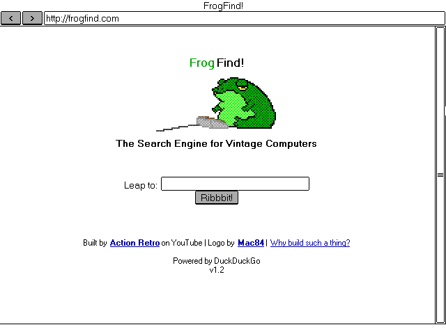

# MicroWeb DOS web browser

MicroWeb is a web browser for DOS! It is a 16-bit real mode application, designed to run on minimal hardware.

## Minimum requirements
To run you will need:
* Intel 8088 or compatible CPU
* CGA, EGA, VGA or Hercules compatible graphics card
* A network interface (it is possible to use your machine's serial port with the EtherSLIP driver)
* A mouse is desirable but not 100% required
* 640k RAM is desirable but can run with as little as 384K
* EMS can be used if available and is recommended for loading heavier web pages

## Limitations
* HTTP only (See HTTPS limitations below)
* Only GIF images are rendered, although PNG and JPEG dimensions are loaded for layout purposes
* No CSS or Javascript
* Very long pages may be truncated if there is not enough RAM available
* Mouse cursor is currently not visible in Hercules mode

## Keyboard shortcuts
| Key				| Shortcut                                        |
|-------------------|-------------------------------------------------|
| Escape            | Exit                                            |
| F2                | Invert screen (useful for old LCD displays)     |
| F3                | Toggle title bar / status bar visibility        |
| F5                | Reload page                                     |
| F6 / Ctrl+L       | Focus address bar                               |
| Tab / Shift+Tab   | Cycle through selectable page elements          |
| Enter             | Follow link / press button                      |
| Cursor up/down    | Scroll page                                     |
| Page up/down      | Scroll page in large increments                 |
| Home              | Jump to start of page                           |
| End               | Jump to end of page                             |

## Supported video modes
MicroWeb supports a wide range of different video modes. You will be asked on startup to select a mode and one will be suggested based on your detected hardware.
* 640x200 monochrome (CGA)				
* 640x200 inverse monochrome (Palmtop CGA)
* 320x200 4 colours (CGA)
* 320x200 16 colours (Composite CGA)
* 640x200 16 colours (EGA)		
* 640x350 monochrome (EGA)				
* 640x350 16 colours (EGA)				
* 640x480 monochrome (VGA)				
* 640x480 16 colours (VGA)				
* 320x200 256 colours (VGA)				
* 720x348 monochrome (Hercules)		
* 640x400 monochrome (Olivetti M24)
* 640x400 monochrome (Toshiba T3100)
* 240x128 monochrome (HP 95LX)		

## Command line options
You can use a URL as an argument to load a specific page on startup. This can also be a path to a local html file. 

| Option    | Effect
|-----------|-------
| -i        | Start with inverted screen colours (useful for some LCD monitors)
| -noems    | Disable EMS memory usage
| -noimages | Disables image decoders - useful for very low memory setups
 
For example `MICROWEB -noems http://68k.news` will load the 68k.news website on startup but disable the EMS routines

## HTTPS limitations
TLS encryption is currently not supported which means that only HTTP servers can be accessed directly. There are some options for HTTPS sites:
* Use a proxy server such as [retro-proxy](https://github.com/DrKylstein/retro-proxy) which converts HTTPS to HTTP. You can configure a proxy server by setting the HTTP_PROXY environment variable before running MicroWeb. e.g. `SET HTTP_PROXY=192.168.0.50:8000`
* Use the [FrogFind!](http://www.frogfind.com) web service to view a stripped down version of a site. If MicroWeb is redirected to an HTTPS site then it will generate a FrogFind link for your convenience.

## Getting started
Check out the [releases page](https://github.com/jhhoward/MicroWeb/releases) which will include a pre-built binary. Also available are FreeDOS boot disk images for 360K and 720K floppies, which are configured to work with a NE2000 network adapter. These boot images can be used in an emulator such as [PCem](https://pcem-emulator.co.uk/).

## Network setup
MicroWeb uses Michael Brutman's [mTCP networking library](http://www.brutmanlabs.org/mTCP/) for the network stack. You will need a DOS packet driver relevant to your network interface. You can read more about configuring DOS networking [here](http://brutmanlabs.org/Dos_Networking/dos_networking.html)

## Build instructions
To build you will need the [OpenWatcom 1.9 C++ compiler](https://sourceforge.net/projects/openwatcom/files/open-watcom-1.9/). 
Use OpenWatcom's wmake to build the makefile in the project/DOS folder. Currently only builds in a Windows environment.

